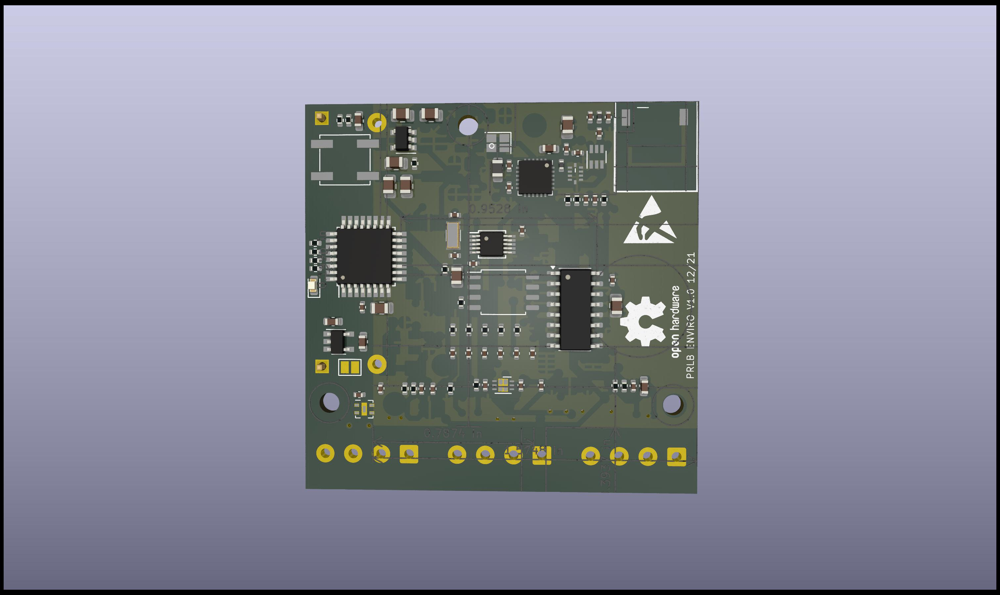
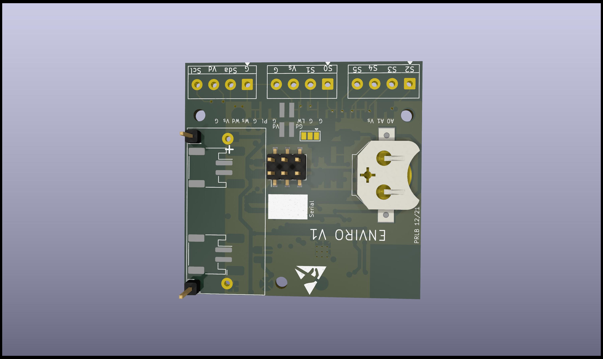

# ESP32 LoRa Environmental Datalogger — Sink Node

Custom ESP-IDF firmware and KiCad-designed PCB for a low-power LoRa
environmental sensor network. This repository contains the **sink node**
firmware — the receiver that collects raw telemetry from a cluster of
distributed logger nodes, tags and stores it locally, and periodically
forwards it downstream in batches.



## Overview

This sink node receives raw sensor data transmitted over LoRa by a
cluster of distributed logger nodes in the field. Each incoming
transmission is tagged with the originating device's name/ID and
written to local storage. Rather than forwarding data immediately, the
sink accumulates readings over an extended interval — roughly one to
two days — before forwarding the batched dataset downstream. This
reduces network/forwarding overhead and allows the sink to operate
reliably even if the downstream connection is intermittent.

## Key features

- Custom LoRa receiver driver written in C (`LoRa/LoRa.c`, `LoRa/LoRa.h`)
  — no off-the-shelf library dependency
- Built on ESP-IDF for the ESP32-C6, enabling direct hardware control
  and fine-grained power management
- Per-device tagging: incoming packets are attributed to their
  originating logger node before storage
- Local buffering with scheduled, batched forwarding (configurable
  interval, currently ~1–2 days) rather than per-packet transmission
- Reproducible dev environment via `.devcontainer`
- Custom PCB schematic designed in KiCad

## Hardware

- **MCU:** ESP32-C6
- **Radio:** SX1276 (LoRa)
- **Role:** Sink / receiver node — aggregates data from a cluster of
  logger nodes over LoRa
- **PCB:** Custom schematic designed in KiCad — see
  [`/hardware/schematic`](hardware/schematic)

| PCB — Top | PCB — Bottom |
|---|---|
|  |  |

KiCad schematic and project files: [`hardware/schematic`](hardware/schematic)

> **Note:** This repository currently includes the KiCad schematic
> (`PCB.kicad_sch`) and project file (`PCB.pro`). The PCB layout file
> will be added once finalized.

## How it works

1. **Receive** — The sink listens continuously for LoRa transmissions
   from any logger node in the cluster.
2. **Tag** — Each incoming payload is associated with the sending
   device's name/ID so readings can be traced back to their source.
3. **Store** — Tagged readings are written to local storage on the
   sink node.
4. **Buffer** — Data accumulates locally rather than being forwarded
   immediately after each reception.
5. **Forward** — After a configured interval (currently ~1–2 days),
   the accumulated batch is forwarded downstream.

## Repository structure

```text
esp32-lora-environmental-datalogger-sink/
├── main/
│   ├── main.c              # Application entry point and sink node logic
│   └── CMakeLists.txt
├── LoRa/
│   ├── LoRa.c                # Custom LoRa driver implementation
│   └── LoRa.h
├── hardware/
│   ├── schematic/
│   │   ├── PCB.kicad_sch      # KiCad schematic
│   │   └── PCB.pro            # KiCad project file
│   └── Images/
│       ├── PCB_Top.jpg
│       └── PCB_Bottom.jpg
├── .devcontainer/            # Reproducible dev environment config
├── .vscode/                  # Editor configuration
├── CMakeLists.txt            # Project-level ESP-IDF build config
└── sdkconfig                 # ESP-IDF project configuration
```

## Build instructions

This project uses [ESP-IDF](https://docs.espressif.com/projects/esp-idf/en/latest/).

```bash
# Set up ESP-IDF environment
. $HOME/esp/esp-idf/export.sh

# Clone the project
git clone https://github.com/SuryaTejaJakka14/esp32-lora-environmental-datalogger-sink.git
cd esp32-lora-environmental-datalogger-sink

# Configure, build, and flash
idf.py set-target esp32c6
idf.py build
idf.py -p [PORT] flash monitor
```

## PCB design (KiCad)

The schematic was designed from scratch in KiCad to integrate the
ESP32-C6, SX1276 LoRa module, and supporting power circuitry for the
sink node.

- Schematic and project files: [`hardware/schematic`](hardware/schematic)
- Board photos: [`hardware/Images`](hardware/Images)
- Full build log: [Hackaday.io project](your-hackaday-link-here)

## What I'd improve next

- Finalize and add the KiCad PCB layout file (`.kicad_pcb`)
- Make the forwarding interval configurable via `Kconfig`/`sdkconfig`
  rather than hardcoded
- Add secure communication (TLS/authentication) for the downstream
  forwarding step
- Add power optimization / sleep mode tuning for extended field
  deployment

## Related projects

- [Job Intelligence Data Pipeline](https://github.com/SuryaTejaJakka14/job-intelligence-data-pipeline) — data engineering and automation pipeline

## Author

**Surya Teja Jakka**  
Data & IoT Engineer | Embedded Systems | Data Pipelines

- GitHub: [@SuryaTejaJakka14](https://github.com/SuryaTejaJakka14)
- LinkedIn: [linkedin.com/in/teja-j14](https://www.linkedin.com/in/teja-j14/)
- Email: sj888@nau.edu
